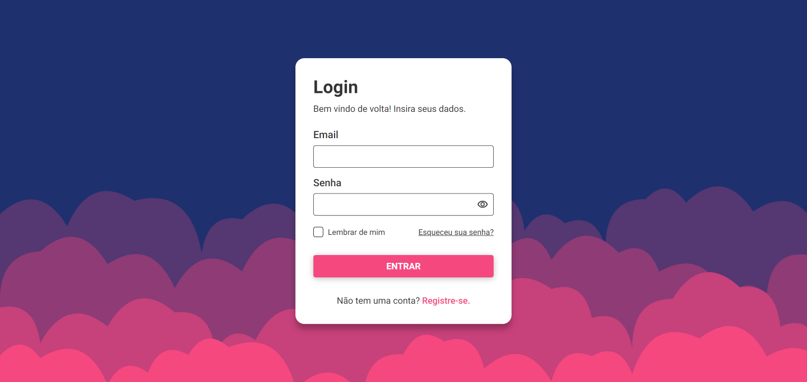
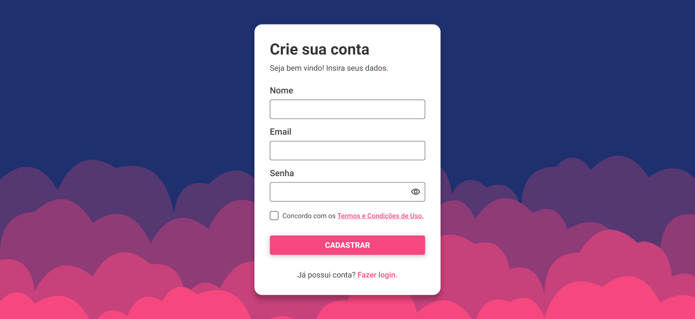
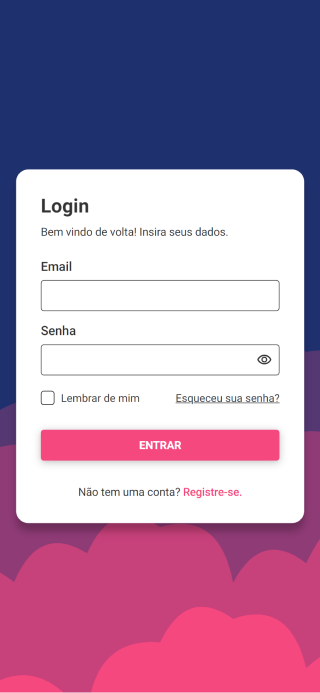
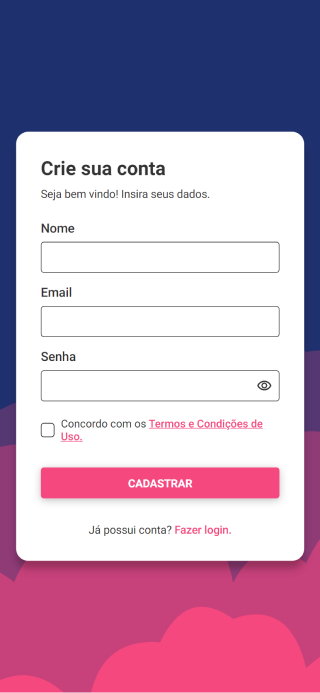

# Projeto - Tela de Login e Cadastro
    
***
Esse projeto trata-se de uma página onde o usuário efetuaria o login e o cadastro, o mesmo está responsivo podendo ser acessado por diferentes dimensões de tela. Para realizá-lo eu utilizei: ReactJS, TypeScript e Styled Components.

##  🖥️ Imagens do projeto

 

## 🔗 Link da página
https://tsb-login.netlify.app/

## 👨‍💻 Tecnologias Utilizadas
* [ReactJS](https://pt-br.reactjs.org/docs/getting-started.html)
* [TypeScript](https://www.typescriptlang.org/docs/)
* [Styled-Components](https://styled-components.com/docs)
***
**Desenvolvido por: [Thiago Batista](https://github.com/ThiagoSantosBatista/).**